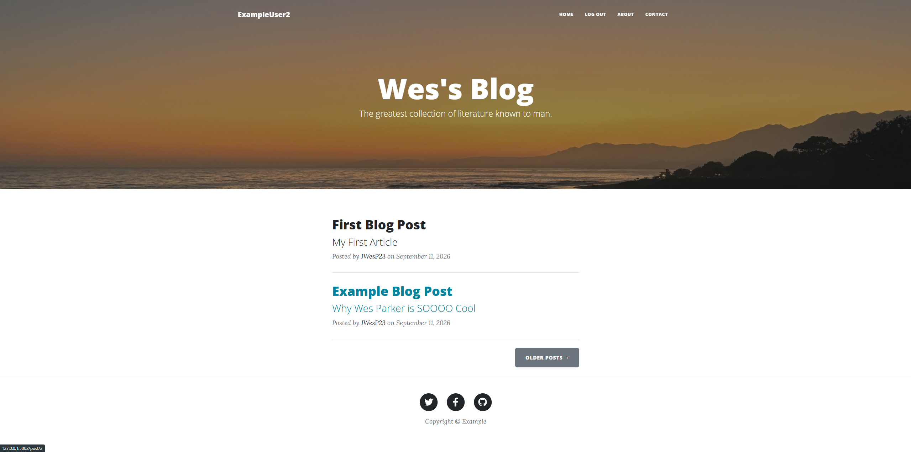
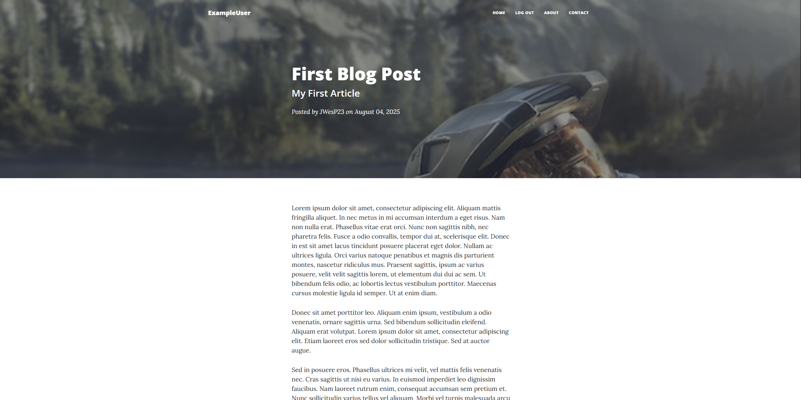
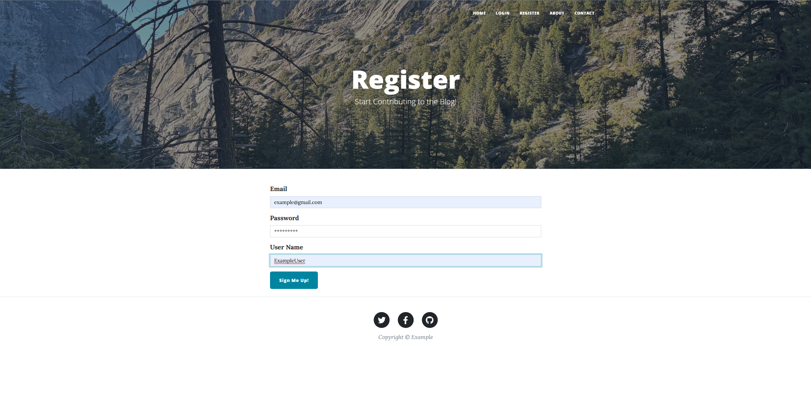
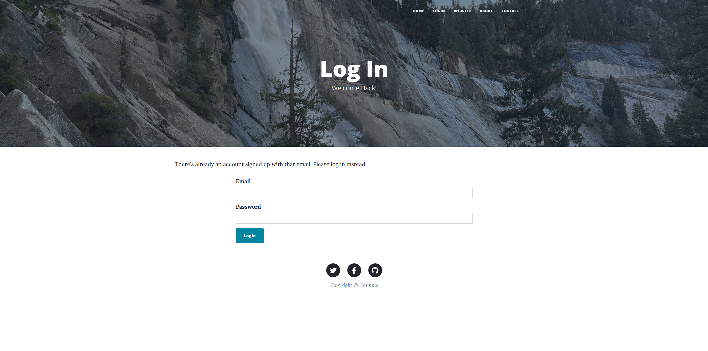
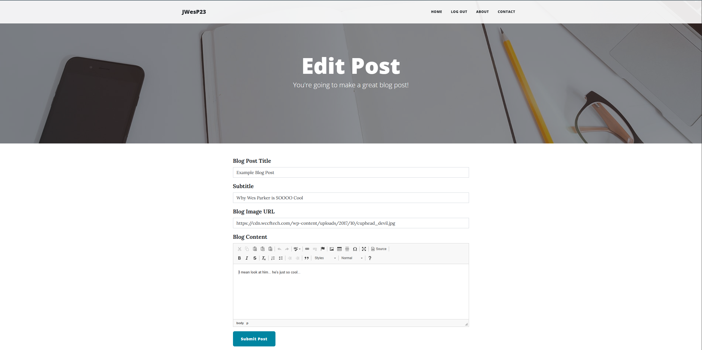
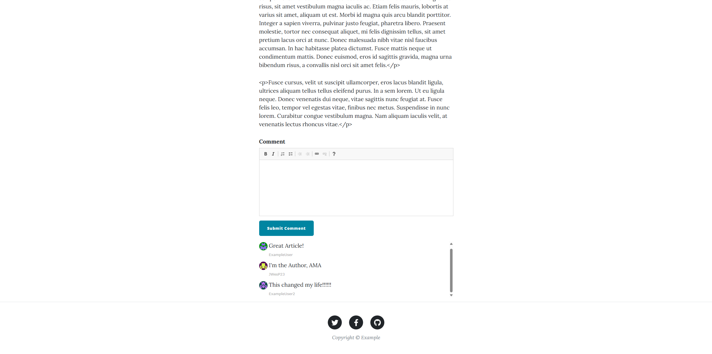
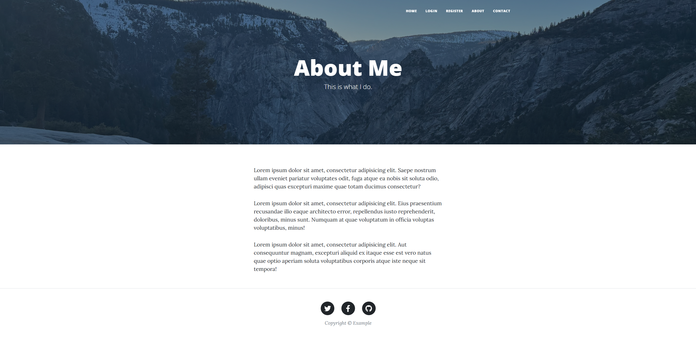
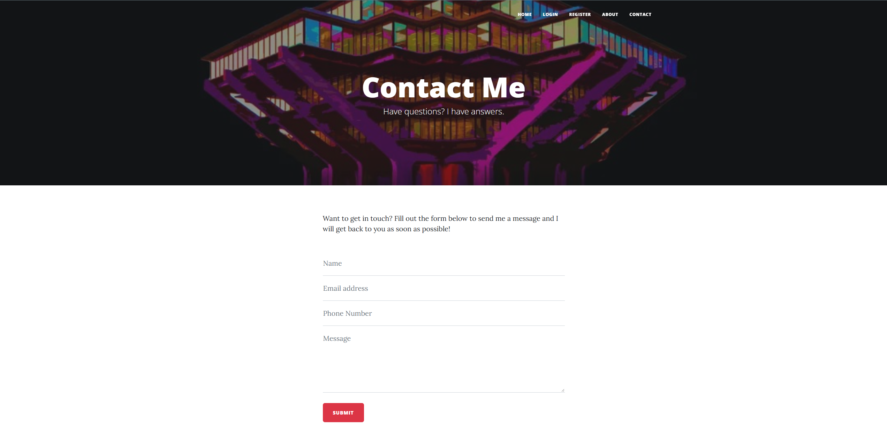

# Flask Blog

A full-stack blog application built with Flask. Supports user registration and login, role-based access control (admin vs. regular users), rich-text post creation via CKEditor, and a commenting system with Gravatar-based avatars.



## Features


- **Role-based access control** — admin-only routes for creating, editing, and deleting posts
  - 
- **User authentication** — registration and login with hashed passwords (Werkzeug's `pbkdf2:sha256`)
  
  - 
  - 

- **Rich-text editing** — CKEditor integration for writing post content and comments
  - 
- **Commenting system** — logged-in users can comment on posts, with Gravatar avatars pulled from their email
  - 
- **SQLAlchemy models** — relational structure linking users, posts, and comments
  - 
- **Bootstrap 5 styling** via Flask-Bootstrap


  - 
## Tech Stack

- [Flask](https://flask.palletsprojects.com/)
- [Flask-SQLAlchemy](https://flask-sqlalchemy.palletsprojects.com/) / [SQLAlchemy](https://www.sqlalchemy.org/)
- [Flask-Login](https://flask-login.readthedocs.io/)
- [Flask-WTF](https://flask-wtf.readthedocs.io/) / [WTForms](https://wtforms.readthedocs.io/)
- [Flask-CKEditor](https://flask-ckeditor.readthedocs.io/)
- [Flask-Bootstrap](https://bootstrap-flask.readthedocs.io/)
- [Flask-Gravatar](https://pypi.org/project/Flask-Gravatar/)
- SQLite (via SQLAlchemy)

## Getting Started

### Prerequisites

- Python 3.10+
- pip

### Installation

1. Clone the repo
   ```bash
   git clone https://github.com/JWesP23/Blog-Site.git
   cd Blog-Site
   ```

2. Create and activate a virtual environment
   ```bash
   python -m venv venv
   ```
   - Windows (PowerShell): `venv\Scripts\Activate.ps1`
   - macOS/Linux: `source venv/bin/activate`

3. Install dependencies
   ```bash
   pip install -r requirements.txt
   ```

4. Set up environment variables

   Create a `.env` file in the project root:
   ```
   FLASK_SECRET_KEY=your-generated-secret-key-here
   ```
   Generate a key with:
   ```bash
   python -c "import secrets; print(secrets.token_hex(16))"
   ```

5. Run the app
   ```bash
   python main.py
   ```
   The app will be available at `http://127.0.0.1:5002`.

On first run, the database (`instance/Blog_Content.db`) is created automatically with empty tables.

### Creating an admin account

New registrations default to `"USER"` access. To promote an account to admin, open the database in [DB Browser for SQLite](https://sqlitebrowser.org/) and change that user's `access` column from `USER` to `ADMIN`.

## Project Structure

```
.
├── main.py            # App factory, routes, database models
├── forms.py            # WTForms definitions
├── requirements.txt    # Python dependencies
├── templates/           # Jinja2 HTML templates
├── static/              # CSS/JS/images/assets
└── instance/
    └── Blog_Content.db  # SQLite database (gitignored)
```

## Environment Variables

| Variable | Description |
|---|---|
| `FLASK_SECRET_KEY` | Secret key used for session signing and CSRF protection |

## License

MIT
